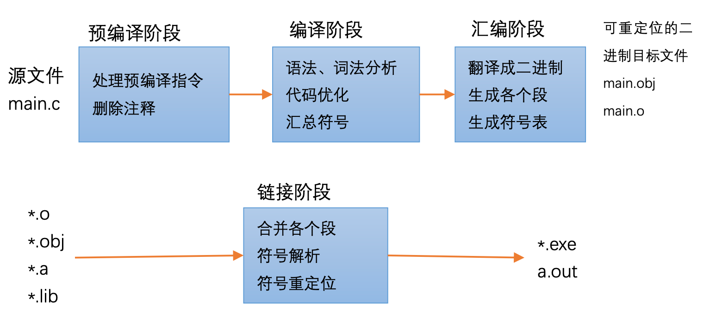
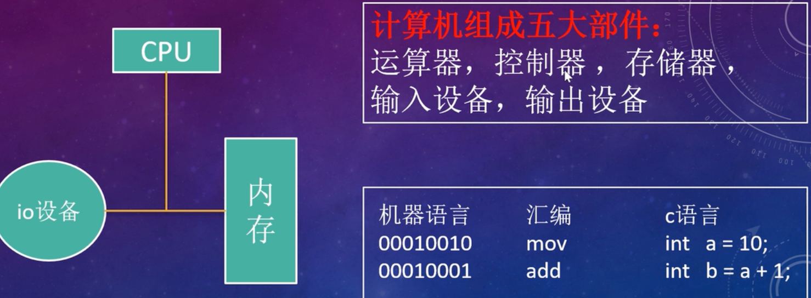

# Linux 的编译与运行 快速入门学习


## gcc 分步编译链接

```shell
(1) 预编译 :  # 删掉注释   加上头文件  宏也会被替换
 gcc -E main.c -o main.i      

(2) 编译:   # 生成汇编代码
 gcc -S main.i -o main.s

(3) 汇编:  # .0 文件 已经是二进制文件
 gcc -c main.s -o main.o

(4) 链接: # 可执行文件
 gcc main.o -o main

一般就连起来用
gcc main.c -o main
```


编译链接过程



更加详细的：

3.1 预编译阶段

 a) 删除所有的“#define”，并且展开所有的宏定义;
 b) 处理所有的条件预编译指令，“#if”、“#ifdef”、“#endif”等;
 c) 处理“#include”预编译指令，将被包含的文件插入到该预编译指令的位置;
 d) 删除所有的注释;
 e) 添加行号和文件名标识，以便于编译器产生调试用的符号信息及编译时产生编译错误和警告时显示行号;
 f) 保留所有的#pragma 编译器指令，因为编译器需要使用它们。

3.2 编译阶段 

词法分析、语法分析、语义分析，代码优化，汇总符号。

3.3 汇编阶段
 	将汇编指令翻译成二进制格式，生成各个 section，生成符号表。

3.4 链接阶段

  a) 合并各个 section，调整 section 的起始位移和段大小，合并符号表，进行符号解析， 给符号分配虚拟地址

  b) 符号重定位


为什么一定要编译链接？  能直接执行的是二进制指令。




## 多个源文件的编译

```shell
gcc -o main  main.c max.c add.c  (一步到位)

或者先汇编再合成
gcc -c  main.c   / -c max.c  / -c add.c
gcc -o main  main.o max.o add.o

```


## Makefile  make  实现自动化编译


```shell


```


