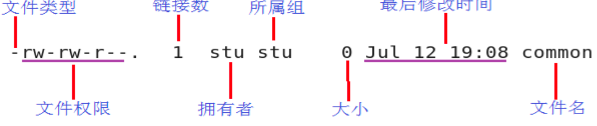

# linux命令复习


```shell
uname -a 
/usr 存放系统应用程序及文档
/proc 虚拟文件系统目录，以进程为单位存储内存的映射
/lib 存放库文件
/boot 系统内核及启动有关的文件
/var 存放系统运行中常改变的文件， 如系统日志

◼ 普通文件 ‘-’
◼ 目录文件 ‘d’
◼ 管道文件 ‘p’
◼ 链接文件 ‘l’
◼ 设备文件(块设备 ’b’ 、字符设备 ‘c’) 
◼ 套接字文件 ‘s


ls -al 

```




```shell
Grep -c 行计数   -v 去反 只打印不包含的所有行       -n 行号  -i 不去分大小写

删除非空目录  rm -r 
cp -r 
rm -r 

find -name 
find ./ ""


(1) find命令是根据文件的属性进行查找，如文件名，文件大小，所有者，所属组，是否为空，访问时间，修改时间等。
示例	含义
find / -amin -10	查找在/路径下最后10分钟访问的文件(access time)
find / -amin +10	查找在/路径10分钟前访问的文件(access time)
find / -atime -2	查找在/路径下最后48小时访问的文件
find / -empty	查找在/路径下为空的文件或者文件夹
find / -group cat	查找在/路径下属于 group为cat的文件
find / -mmin -5	查找在/路径下最后5分钟里修改过的文件(modify time，修改文件内容)
find / -mtime -1	查找在/路径下最后24小时里修改过的文件
find / cmin -2	查找在/路径下最后2分钟里改变过的文件(如修改属性或者文件内容)
find / ctime -1	查找在/路径下最后24小时内里改变过的文件(如修改属性或者文件内容)
find / -type f	查找/路径下文件类型为f的文件（d:目录，f：一般文件）
find / -user fred	查找在/路径下属于fred这个用户的文件
find / -size +10000c	查找出大于10000000字节的文件(c:字节，w:双字，k:KB，M:MB，G:GB)
find / -size -1000k	查找出小于1000KB的文件

atime 是指access time，即文件被读取或者执行的时间，修改文件是不会改变access time的。
ctime 即change time文件状态改变时间，指文件的i结点被修改的时间，如通过chmod修改文件属性，ctime就会被修改。
mtime 即modify time，指文件内容被修改的时间。

find /tmp -size +10000c -and -mtime +2 #在/tmp目录下查找大于10000字节并在最后2分钟内修改的文件
find / -user mysql-or -user test # 在/目录下查找用户是mysql或者test的文件文件
find /home ! -user test #在/home目录中查找所有不属于test用户的文件


(2) grep是根据文件的内容进行查找，会对文件的每一行按照给定的模式(patter)进行匹配查找。

参数	含义
-c	只输出匹配行的计数
-i	不区分大小写
-h	查询多文件时不显示文件名
-l	查询多文件时只输出包含匹配字符的文件名
-n	显示匹配行及行号
-s	不显示不存在或无匹配文本的错误信息
-v	显示不包含匹配文本的所有行


参数	含义
\	忽略正则表达式中特殊字符的原有含义
^	匹配正则表达式的开始行
$	匹配正则表达式的结束行
<	从匹配正则表达 式的行开始
>	到匹配正则表达式的行结束
[ ]	单个字符，如[A]即A符合要求
[ - ]	范围，如[A-Z]，即A、B、C一直到Z都符合要求
.	所有的单个字符
*	有字符，长度可以为0

grep ‘test’ d*	显示所有以d开头的文件中包含 test的行
grep ‘test’ aa bb cc	显示在aa，bb，cc文件中包含test的行
grep ‘[a-z]{5}’ aa	显示所有包含每行字符串至少有5个连续小写字符的字符串的行
grep nginx /usr/local	显示/usr/local目录下的文件(不含子目录)包含nginx的行
grep -r nginx /usr/local	显示/usr/local目录下的文件(包含子目录)包含nginx的行
grep -w pattern files	只匹配整个单词，而不是字符串的一部分(如匹配nginx，而不是nginxd)


```


```shell

wc -l  -c (char) -w (world)

shutdown -h now  
halt / init 0

显示文件前几行
head -2 file.txt
tail -2 file.txt

o下一行 O上一行
i 当前  I行头
a 下一个字符  A行末


2. / //对文本进行全文向下搜索字符串 string
3. ? //对文本进行全文向上搜索字符串 string

4. u //撤销上一次操作
5. ctrl + r // 恢复上一次撤销操作
6. r //替换一个字符


5. :w newfile //另存为
6. :set nu //显示行号

10. :n，m s/oldstring/newstring //替换整个文本每行的第一个oldstring
11. :n, m s/oldstring/newstirng/g //替换整个文本所有的 oldstring


12. /string //向下搜索string
13. ?string //向上搜索 string
```


用户管理


````shell
useradd newname 添加一个新的用户 newname
-G -s -d
将新用户添加到副组 指定新用户默认使用的 shell 终端
指定新用户登录默认进入的目录

userdel 删除用户时，首先确保该用户没有登录。userdel 默认仅删除用户，不会删除家目 录及家目录中的文件，若想删除用户的同时移除家目录， 那么使用 userdel -r username。
````


